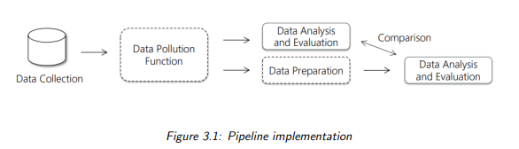
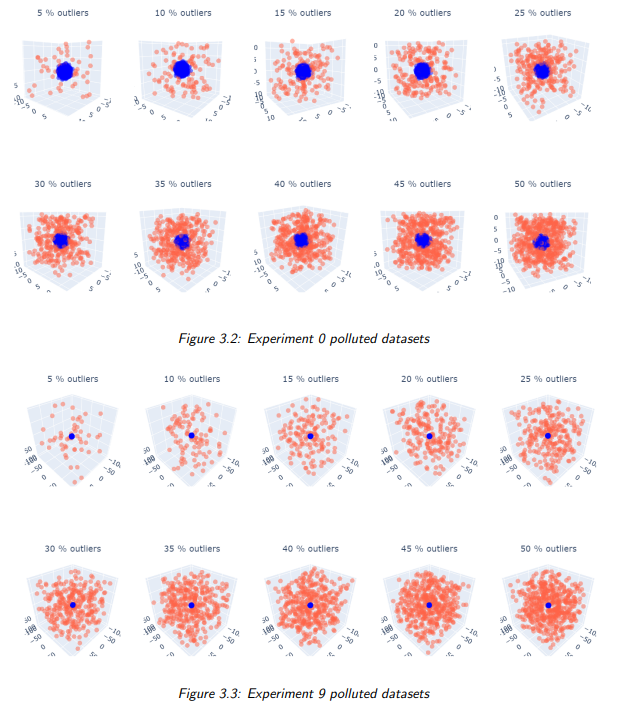
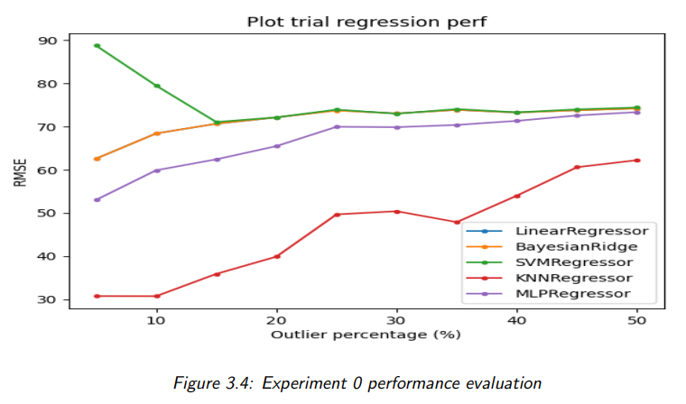
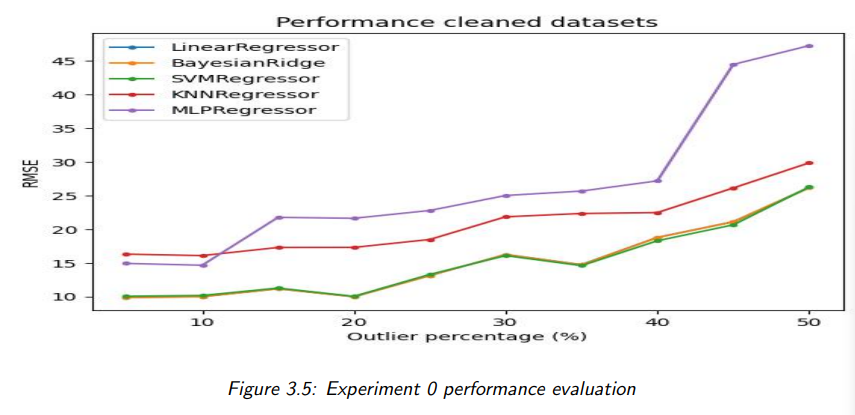

# DataQualityImpact
The following repository delves into the impact of enhancing dataset accuracy during the
preprocessing phase on the overall performance of a regression model. The primary focus
lies in the process of identifying and removing outliers, an approach employed to augment
the model’s accuracy.
Regarding the dataset for analysis, the decision has been made to utilize a synthetically
generated dataset that closely mimics a real-world dataset.

## Setup Choices
### Data collection
The first phase of the project involves data collection, and as mentioned earlier, the dataset
for analysis has been synthetically generated for the reasons stated above. Specifically, I
choose to use the make regression function from scikit-learn.
```
make_regression (
n_samples =1000 ,
n_features =3 ,
n_informative =3 ,
n_targets =1 ,
bias =10.0 ,
effective_rank = None ,
tail_strength =0.5 ,
noise =10.0 ,
seed =2023
)

```
An explanation of the most significant parameters and the rationale behind their selection:
- **n_samples**: A dataset with 1000 samples might be deemed sufficiently representative to address the complexity of the problem. This size can capture variations in
the data and provide a reliable basis for analysis.
- **n_features**: I kept 3 features to enhance visualization, manage model complexity,
and reduce computational requirements, ensuring a focused analysis on key variables for interpretation and understanding of relationships.
- **bias**:  Introducing a bias term at 10 can simulate scenarios where there might be
measurement errors or missing information regarding relevant variables not explicitly
incorporated in the model. This contributes to creating a more realistically complex
dataset by accounting for unmodeled factors or uncertainties in the relationship
between features and the target variable.
- **noise**: Setting noise to 10 introduces realistic variability based on empirical observations, enhancing the dataset’s realism. This choice reflects uncertainties and
measurement errors, contributing to a more authentic representation and improving
the practicality of the regression analysis.

### Experiments
I opted to conduct 10 distinct experiments on the synthetically generated dataset, subsequently contaminated using the **data pollution** function. In each experiment, I’ve
introduced outliers at varying distances within the dataset. Furthermore, within each experiment, I varied the percentage of introduced outliers from 5 % to 50 % to assess their
impact systematically.

```

for i in range ( n_experiments ) :
    print ( " Experiment {} " . format ( i ) )
    # A: DATA COLLECTION  
    X , y = make_dataset_for_regression ( n_samples =1000 , n_features = n_features , n_informative =3 , n_targets =1 , bias =10.0 , effective_rank = None , tail_strength =0.5 ,
            noise=10.0 , seed =2023)
    # B: DATA POLLUTION
    # for each experiment the outlier distance grows
    # from the X we build ten different versions of the dataset with a different percentage of outliers
    X_polluted_list = []
    X_outliers_list = []
    for j in range (5 ,51 ,5) :
      a , b = data_pollution ( X = X . copy () , n_features = n_features , outlier_percentage = j /100 , distribution = " random " , low_bound = -10 - i * 10 , high_bound = 10 + i *10)
      X_polluted_list.append ( a )
      X_outliers_list.append ( b )


```

### Pipeline implementation

To implement the pipeline for each of the 10 experiments, i followed these steps:

  • **Data collection**: Using the make regression function as explained in Chapter 2. I
  have created a dataset for each experiment on which outliers are introduced with
  different distances. Inside each experiment outliers distance is the same but the
  percentage of outliers vary from 5 % to 50 %.
  
  • **Data pollution**: Through a dataset pollution function for each experiment outliers
  are randomly introduced at varying distances and with different percentages.
  
  • **Data Analysis on Polluted Datasets**: For each experiment and for each percentage of introduced outliers (5 % to 50 %), I performed regression algorithms,
  subsequently comparing the results with those obtained after the cleaning phase.

  • **Data Preparation**: In this phase, outliers were detected and removed using the
  DBSCAN technique.

  • **Data Analysis on Cleaned Dataset**: After having applied Data Preparation to
  the datasets I reapply regression to compare the results with those obtained using
  the polluted datasets.



### Data Pollution
The data pollution function is used to contaminate the dataset by adding outliers to it.
In particular, inside the main I’ve called this function in the following way:

```
# B: DATA POLLUTION
# from the X we build ten different versions of the dataset
with a different percentage of outliers
X_polluted_list = []
X_outliers_list = []
# for each experiment I introduce different percentages of
outliers
for j in range (5 ,51 ,5) :
  a , b = data_pollution ( X = X . copy () , n_features = n_features , outlier_percentage = j /100 , distribution = " random " , mean = -10 - i * 10 , std = 10 + i *10)
  X_polluted_list . append ( a )
  X_outliers_list . append ( b )
```

For each experiment the outlier distance grows 10 times * i (experiment number).
Inside the data pollution function based on the passed parameter outlier percentage,
some points are randomly chosen to be transformed into outliers by applying a shift. This
shift can be random, normal, or multinomial, depending on the requirement. In my case
and in the experiments presented in the report, a random shift was used.

```
size = int ( n_samples * outlier_percentage )
# random pick # size indices of samples to make them outliers
outlier_indices = np . random . choice ( n_samples , size = size ,
replace = False )
# how much i want to shift the outliers and which distribution
to use ?
if distribution == ’ normal ’:
  outliers_shift = np . random . normal ( loc = mean , scale = std , size =( size , n_features ) )
elif distribution == ’ random ’:
  outliers_shift = np . random . uniform ( mean , std , size =( size , n_features ) )
elif distribution == ’ multinomial ’:
  outliers_shift = np . random . multinomial ( size =( size , n_features ) )

```

Then the shift is actually applied to the selected indexes and the new dataset polluted
is returned:

```
# create the polluted dataset
for j , i in enumerate ( outlier_indices ) :
  df_polluted . iloc [ i ] += outliers_shift [ j ]
return df_polluted . values , outlier_indices )
```

### Visualization of the outliers introduced
To gain a visual understanding of how data pollution works, I also implemented a function
named print dataset polluted to visualize in 3D, for each experiment, the dataset with
the addition of outliers randomly generated at different percentages. Outliers are depicted
in red, while the remaining points are shown in blue. The more the experiment is high the
more the distance between outliers and not outliers grows as we can see in the example
down here.




###  Data Analysis on Polluted Datasets
After introducing the outliers, we assess the performance of various regression algorithms
on the ”dirty” datasets using two different metrics: performance and distance between
train and test. (speed is not considered since is not relevant for the analysis we are conducting). We evaluate these metrics across five different regression algorithms (”LinearRegressor,” ”BayesianRidge,” ”SVMRegressor,” ”KNNRegressor,” and ”MLPRegressor”).

```
# D: DATA ANALYSIS ON POLLUTED DATASETS
results_for_each_algorithm_polluted = []
for algorithm in REGRESSION_ALGORITHMS :
  results_for_each_percentage_polluted = []
  for d_polluted in X_polluted_list :
    result = regression ( d_polluted , y , algorithm , SEED )
    results_for_each_percentage_polluted . append ( result )
  results_for_each_algorithm_polluted.append(results_for_each_percentage_polluted )
```

### Data preparation
In this phase, I need to remove the previously introduced outliers. Several removal methods
have been tried, but the most effective one appears to be DBSCAN, a clustering-based
resolution method.
The reasons why DBSCAN performed better can be listed as follows:

  • **Density-based Approach**: DBSCAN excels in identifying outliers based on their
density within the dataset. It is particularly effective when outliers exhibit lower
density compared to the main clusters, allowing it to separate them more efficiently.
Since in our datasets the not-outliers have an higher density with respect to outliers,
dbscan is the perfect choice.

• **Adaptability to Cluster Shapes**: since my data pollution function introduce
outliers with no assumptions on the shape, dbscan is the best approach because is
able to to adapt to clusters of various shapes ensures that outliers forming irregularly
shaped clusters are more accurately identified and isolated.

• **Easily tunable**: DBSCAN’s parameters, such as epsilon (neighborhood distance)
and minimum points, can be adjusted to accommodate different characteristics of
the data. This adaptability proves beneficial when dealing with varying densities
and sizes of outliers as in our case when dealing with different percentages of outliers introduced ( 5 % to 50 %). In my case the perfect fit are: - epsilon = 0.9 -
min samples = 5

Below is the implementation of the outliers removal function.
```
def data_preparation (X ,y , n_features ) :
  """
  @param X: the ndarray to clean
  """
  df = pd . DataFrame (X , columns =[ f ’ feature_ { i } ’ for i in range (n_features ) ])
  hapter 3. Pipeline Implementation Francesco Zanella
  df [ ’ target ’] = y
  eps = 0.9
  min_samples = 5
  dbscan = DBSCAN ( eps = eps , min_samples = min_samples )
  df [ ’ cluster ’] = dbscan . fit_predict ( df [[ ’ feature_0 ’ , ’ feature_1 ’, ’ feature_2 ’ ]])
  clean_df = df [ df [ ’ cluster ’] != -1]
  outlier_indices = df [ df [ ’ cluster ’] == -1]. index
  # feature_0 , feature_1 , feature_2 , target , cluster
  return clean_df [[ ’ feature_0 ’ , ’ feature_1 ’ , ’ feature_2 ’ ]]. values, clean_df [ ’ target ’ ]. values , outlier_indices

```
### Data Analysis on Cleaned Dataset
After having removed the outliers, we assess the performance of various regression algorithms on the ”cleaned” datasets using two different metrics: performance and distance
between train and test. (speed is not considered since is not relevant for the analysis
we are con- ducting). We evaluate these metrics across five different regression algorithms (”Linear- Regressor,” ”BayesianRidge,” ”SVMRegressor,” ”KNNRegressor,” and
”MLPRegressor”).


```
results_for_each_algorithm_cleaned = []
for algorithm in REGRESSION_ALGORITHMS :
  results_for_each_percentage_cleaned = []
  for h in range ( len ( X_cleaned_list ) ) :
    result = regression ( X_cleaned_list [ h ] ,
    y_cleaned_list [ h ] , algorithm , SEED )
  results_for_each_percentage_cleaned . append ( result )
results_for_each_algorithm_cleaned.append(results_for_each_percentage_cleaned )
```

As we did with the polluted datasets we use some utils functions, plot and print table
to create a plot for each metric and a table with the numeric results to compare the results
the analysis before having cleaned the dataset.
Plot for experiment 0 for performance metric:




## Result Analysis
Analyzing the RMSE and train-test distance graphs reveals that the trend, regardless of
the conducted experiment and therefore the distance of the outliers, is increasing. This
indicates that as the percentage of introduced outliers increase, the difficulty for the model
to predict accurately also increases. This is due to the fact that outliers have the potential
to disrupt the identification of patterns in the data.

Regarding the performance difference among various regression algorithms on datasets
before and after the removal of outliers, a clear distinction in performance is evident. On
the polluted datasets, the average RMSE is around 70, whereas after the cleaning process,
it reduces significantly to approximately 15.

Finally, regarding the removal of outliers in each experiment, upon examining the
outlier removal graphs, it’s noticeable that as the experiment progresses and consequently,
as the distance of the outliers increases, the precision of DBSCAN improves. It succeeds
in correctly identifying approximately 98% of the outliers when the outliers distance is
maximum.


